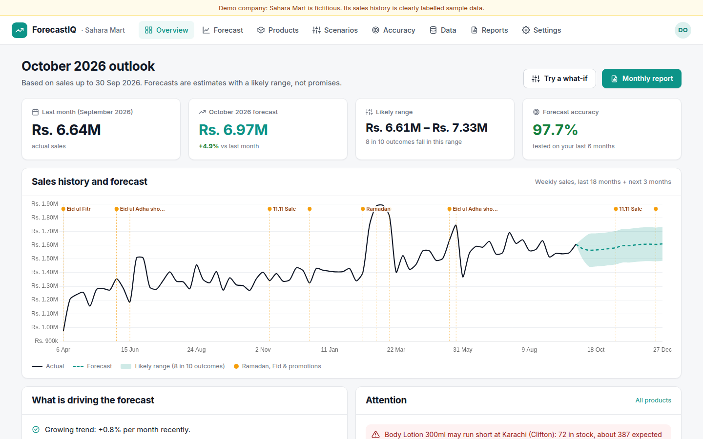

# ForecastIQ: Sales Forecasting Dashboard

**See next month's sales before it happens, so you can plan stock and budget with confidence.**

The client uploads past sales (Excel or CSV). The dashboard shows what is likely to happen next with a realistic range, explains why in plain language, and proves how accurate it is on the client's own past months.



## What it does

| | |
|---|---|
| **Overview** | Last month, next-month forecast with growth %, likely range, accuracy; one chart (solid = actual, dotted = forecast, shaded = likely range, flags for Ramadan/Eid/promotions); plain-language drivers; attention panel (stock-out risk, overstock, declining branch/product) |
| **Forecast explorer** | Filter by product, category, branch; 1/3/6/12 months ahead; daily/weekly/monthly view; table with low/expected/high per month; Excel download |
| **Products & branches** | Ranked tables with last month, next month, growth, sparklines (12 months + forecast), stock-out/overstock/trend labels |
| **Scenarios** | Discount, marketing spend, price increase, new branch → baseline vs scenario lines, revenue and margin impact, clearly labelled as estimates with the assumptions shown; save and share |
| **Accuracy** | "How well would we have predicted the past?": forecast made beforehand vs actual for the last 6 months, average error, "better than a simple guess by X%", methods compared, easy/hard products |
| **Data upload & health check** | Excel/CSV with flexible column names; removes duplicates, flags typing errors, detects stock-outs, finds missing days and asks "We filled them with zero sales. Is this correct?" |
| **Reports** | One-click Monthly Forecast Report (PDF with chart, drivers, risks, product and branch tables) + Excel + short email; monthly schedule |
| **Settings** | Business name, currency, financial-year start, holidays & events calendar (Ramadan, Eid, 11.11, custom campaigns), alert threshold, users & roles, logo and colour |

## How the forecast works

Several methods are compared on the client's own past months (rolling backtest: each month is forecast using only earlier data), and the best is used per series:

1. **Explainable model**: trend (with recent change), weekday pattern, yearly season, Ramadan / Eid / holidays, promotions (discount depth), ad spend, number of branches open. Its coefficients become the plain-language "drivers".
2. **Holt-Winters** exponential smoothing.
3. **Simple guesses** (same as last month, same month last year): the baseline the forecast must beat.

The likely range comes from the measured backtest errors (80% range). Stock-out/missing/typo days are left out of fitting so they don't distort the forecast. No AI service or API key is involved; your data never leaves the server.

## Measured results

`python -m scripts.evaluate` (details in [docs/results.md](docs/results.md)):

| Demo business (sample data) | |
|---|---|
| Average monthly error, last 6 months | **2.3%** (97.7% accurate) |
| Best simple guess (same as last month) | 6.5% error |
| Better than the simple guess by | **65%** |
| Months inside the likely range | 6 of 6 |

**Honest note:** the demo company's sales were generated with patterns similar to what the model looks for, so these numbers are optimistic. Run `python -m scripts.evaluate --file client_sales.xlsx` on a client's real data (or open the Accuracy screen after uploading it) and quote that number instead.

## Quick start

```bash
./run.sh
```
Open http://localhost:8004 and click **Explore demo business**. The first start tests all forecasting methods on the demo data (~1 minute).

- Demo login: `demo@forecastiq.app` / `demo1234`
- Landing page: http://localhost:8004/landing · Privacy: http://localhost:8004/privacy
- Sample upload format: `sample_data/sales_template.csv`; full example: `sample_data/sahara_mart_sales.csv`

## Setting up a real client

1. On a fresh `data/` folder set `DEMO_MODE=0`, `ADMIN_EMAIL`, `ADMIN_PASSWORD` in `.env`.
2. **Data** → upload 12-24+ months of sales (see [docs/data-requirements.md](docs/data-requirements.md)); optionally a stock file (`branch, product, on_hand`).
3. Answer the health-check questions (missing days etc.).
4. **Settings → Holidays & events**: add their past promotions, price changes and branch openings.
5. Check **Accuracy** with them before going live.
6. **Reports**: recipients and day of the month; set SMTP in `.env` for email.

## Free live demo on Hugging Face Spaces

No card needed. The demo data rebuilds itself on every start, so the link always shows a clean demo.

1. Create a free account at https://huggingface.co and a token with **Write** access at https://huggingface.co/settings/tokens.
2. Put optional secrets in `.env` (`SMTP_*` (optional, monthly report email), `CONTACT_EMAIL` / `CONTACT_WHATSAPP`). They are stored as Space secrets, never in the code.
3. Run:
   ```bash
   pip install huggingface_hub
   python scripts/deploy_hf.py --user YOUR_HF_USERNAME --token hf_xxx
   ```
4. Wait for the first build (a few minutes). Your link: `https://YOUR_HF_USERNAME-forecastiq.hf.space`

Free Spaces sleep after about 2 days without visitors; open the link a minute before a client meeting to wake it up.

## Deploying

```bash
docker build -t forecastiq .
docker run -p 8004:8004 -v $(pwd)/data:/app/data --env-file .env forecastiq
```

## Project structure

```
app/
  main.py       Routes, auth, monthly report scheduler
  data.py       Reading Excel/CSV, flexible columns, cleaning + plain-language health check
  model.py      Features, explainable regression, Holt-Winters, backtest, ranges, drivers
  service.py    Datasets, caching, overview/attention, breakdowns, scenarios, accuracy
  reports.py    Monthly PDF (with chart), Excel, email
  calendar.py   Ramadan, Eid, holidays, sales events (Pakistan defaults)
  demo_data.py  Fictitious demo company "Sahara Mart" (30 months, deliberate data problems)
static/         Single-page app, landing page, privacy page
scripts/        evaluate.py, record_demo.py
docs/           Case study, pitch, demo script, one-pager, data requirements, pricing, onboarding, sample report, results, screenshots, demo video
```

## Client materials (in `docs/`)

[Demo video](docs/demo.mp4) · [One-page PDF](docs/one-pager.pdf) · [Case study](docs/case-study.md) · [Pitch & outreach](docs/pitch-and-outreach.md) · [Demo script](docs/demo-video-script.md) · [Data requirements sheet](docs/data-requirements.md) · [Pricing](docs/pricing.md) · [Onboarding](docs/onboarding-and-handover.md) · [Sample monthly report PDF](docs/sample_monthly_report.pdf) · [Results](docs/results.md)

## Honest limits (tell clients upfront)

- Needs enough history; a few months gives weak forecasts (the app warns below 12 months).
- Unexpected events can't be predicted.
- Very slow-moving products are harder to forecast (the Accuracy screen shows which).
- The forecast supports decisions; it does not replace business judgement.
