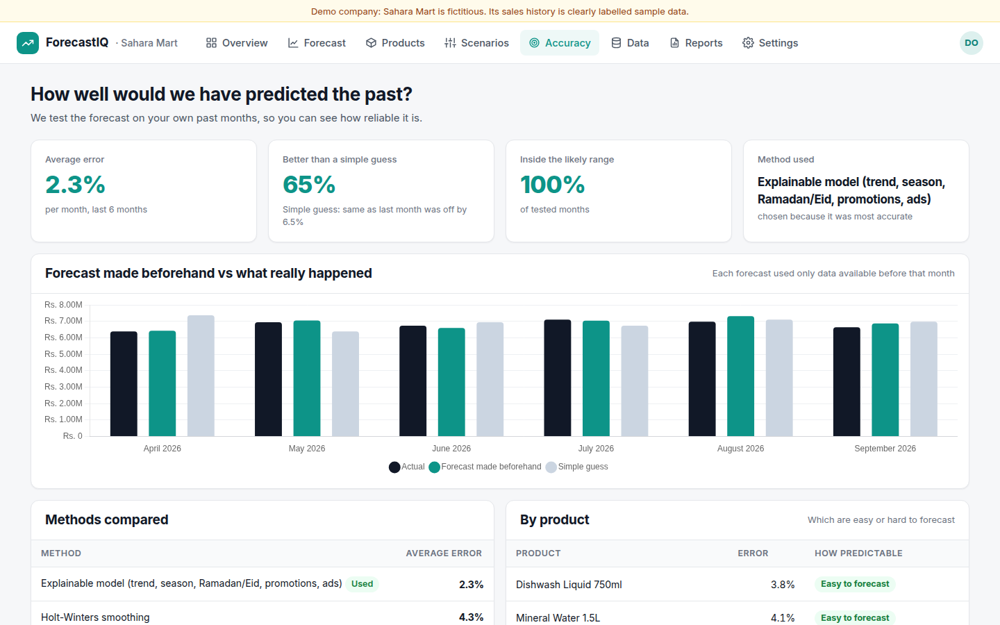

# Case study: forecasting a 3-branch retail chain

> Built on a fictitious demo company (Sahara Mart) with generated sample data. After a real pilot, copy this page and replace the numbers with the client's measured results (template below).

## Problem
A grocery and personal-care chain with 3 branches and 12 key products planned stock from gut feeling and last month's sales. Ramadan and Eid peaks caused stock-outs (dates, cookies), and slow seasons left warehouses full (sunscreen in winter). Finance had no defensible number for next month's budget.

## Solution
ForecastIQ reads two and a half years of daily sales, cleans the export automatically (37 duplicates, 3 typing errors, a 12-day POS outage, stock-out periods), and forecasts every product and branch with a likely range. It explains the forecast in plain language (growth trend, weekend effect, Ramadan), flags products that may run short, and lets the owner test decisions like a 15% discount before making them.

## Result (measured with `scripts/evaluate.py` on sample data)

| | |
|---|---|
| Average monthly error on the last 6 months (forecast made beforehand) | **2.3%** |
| Simple guess ("same as last month") error | 6.5%, so **65% better** |
| Months inside the likely range | 6 of 6 |
| Risks spotted for October | Body Lotion may run short at Karachi (6 days of cover); Karachi branch trending down 5%; sunscreen overstock at Lahore |
| What-if | A 15% discount for 3 months: about Rs. 525k more revenue, but about Rs. 2.4M less margin |

**Honest note:** sample data generated with patterns similar to the model's, so these numbers are optimistic. For a real client, quote the Accuracy screen on their own data.

## Screenshot

---

### Template for a real client case study
- **Client:** type of business, number of branches/products, months of data
- **Problem:** how they planned before; what went wrong (stock-outs, overstock, budget misses)
- **Solution:** what was forecast, data cleaned, events added
- **Result:** backtest error vs simple guess · decisions changed · measured outcome (less overstock, fewer stock-outs) **only if measured**
- **Quote** and the **monthly report** they now receive
